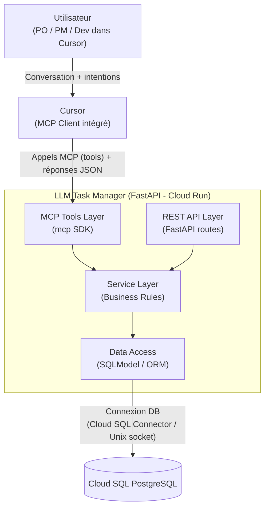
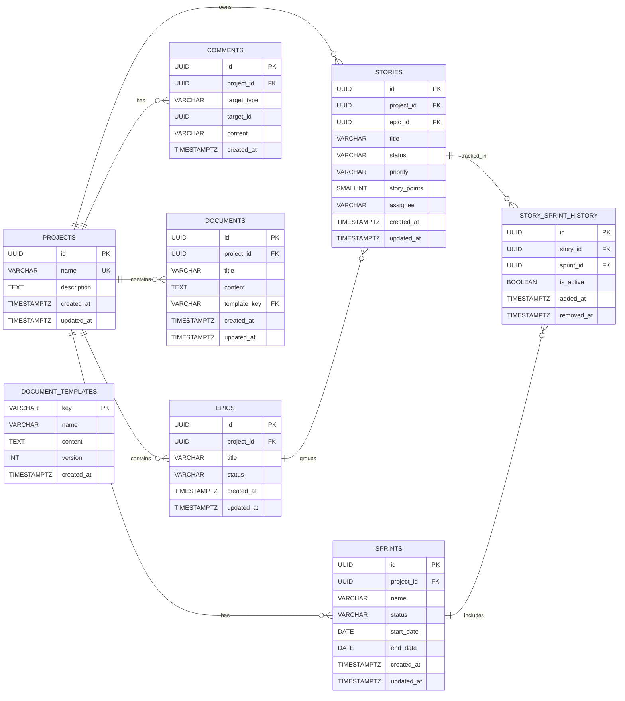
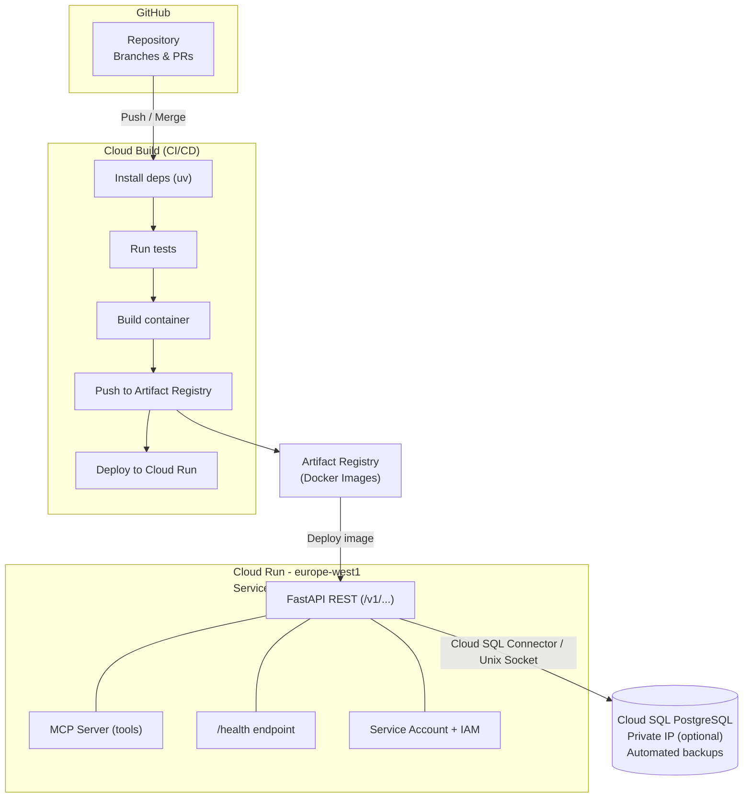

# LLM Task Manager — Architecture

# 📦 Périmètre fonctionnel du produit

Le **LLM Task Manager** est un gestionnaire de tâches conçu pour être accessible :

- Via une **API REST** classique (humains, intégrations)
- Via le **protocole MCP** (interaction native avec LLM)

Le système couvre **6 entités principales** :

---

## 1️⃣ Projet

Fonctionnalités :

- Créer un projet  
- Lister les projets  

Un projet constitue le conteneur principal des epics, stories et sprints.

---

## 2️⃣ Epic

Fonctionnalités :

- Créer un epic  
- Lire un epic  
- Modifier un epic  
- Lister les epics  
- Rechercher par mot-clé  
- Filtrer par statut  

Un epic regroupe un ensemble cohérent de stories liées à une même initiative produit.

---

## 3️⃣ Story

Fonctionnalités :

- Créer une story  
- Lire une story  
- Modifier une story  
- Lister les stories  
- Rechercher par mot-clé  
- Filtrer par :
  - statut  
  - priorité  
  - assignée  
  - sprint  

### Estimation

Les stories sont estimées en **story points**.

### Workflow de statuts

```

backlog → todo → in_progress → in_review → done

```

---

## 4️⃣ Sprint

Fonctionnalités :

- Créer un sprint  
- Démarrer un sprint  
- Clôturer un sprint  
- Affecter des stories  
- Retirer des stories  

### Règle structurelle importante

- Une story appartient à **un seul sprint actif à la fois**  
- Relation many-to-many historique :
  - Une story peut avoir été dans plusieurs sprints successifs  
  - Elle ne peut jamais appartenir à deux sprints simultanément  

---

## 5️⃣ Commentaire

Fonctionnalités :

- Ajouter un commentaire sur :
  - une story  
  - un epic  
- Lister les commentaires  

---

## 6️⃣ Document

Fonctionnalités :

- Créer un document (vide ou depuis un template)  
- Lire un document  
- Modifier un document  
- Lister les documents  
- Rechercher un document  

### Templates prédéfinis

- Problem Statement  
- Product Vision  
- Technical Decision Record  
- Sprint Retrospective  

---

# 1 Business Architecture

## 🎯 Objectif du système

Le **LLM Task Manager** est conçu pour accompagner des équipes produit industrielles utilisant des applications dites de *frontline coordination*.

Le système vise à :

- Réduire le temps passé à structurer le backlog  
- Automatiser l’analyse et la priorisation  
- Maintenir un cadre métier strict malgré l’automatisation par IA  
- Transformer des données terrain en décisions produit structurées  

---

## 👤 Persona 1 — Henri, Product Owner industriel

### Profil

- Product Owner de deux applications industrielles  
- Travaille en lien avec les équipes terrain (usine)  
- Reçoit des retours utilisateurs continus  
- Gère backlog, epics, sprints et priorisation  

### Contexte

Henri passe une grande partie de son temps à :

- Structurer des observations terrain  
- Transformer des retours usine en user stories  
- Prioriser les tâches  
- Suivre l’avancement des sprints  

Son problème principal :  
Il passe trop de temps sur l’opérationnel (création de tâches) et pas assez sur la compréhension stratégique des besoins clients.

### Frustrations

- Trop de manipulation manuelle  
- Difficulté à transformer rapidement des feedbacks en backlog structuré  
- Manque de synthèse intelligente  
- Risque d’erreur ou d’oubli dans la priorisation  

### Besoins

- Transformer automatiquement des observations en user stories  
- Prioriser automatiquement selon données terrain  
- Garder le contrôle final avant validation  
- Réduire le temps administratif  

---

## 🎯 JTBD principal

> En tant que **Product Owner industriel**, je veux transformer automatiquement mes observations terrain et mes données d’usage en user stories priorisées afin de consacrer plus de temps à la compréhension stratégique des besoins clients.

---

## 📌 Cas d’usage — Persona 1

### 1️⃣ Génération automatique de user stories à partir d’observations terrain

Henri fournit :

- Observations en usine  
- Problèmes identifiés  
- Contraintes opérationnelles  

Le système :

- Analyse le contenu  
- Génère des epics et user stories structurées  
- Propose des estimations en story points  
- Demande validation avant création définitive  

**Interaction principale : MCP**

---

### 2️⃣ Priorisation intelligente à partir de data

Henri fournit :

- Document d’analyse utilisateur  
- Données d’usage  
- Feedbacks terrain  

Le système :

- Analyse la fréquence d’usage  
- Croise les feedbacks  
- Propose un score de priorité  
- Classe les user stories  

**Interaction : REST + MCP**

---

### 3️⃣ Validation humaine obligatoire

Le système :

- Demande confirmation avant :
  - création d’epic  
  - création de story  
  - démarrage de sprint  

---

## 👤 Persona 2 — Marie, Product Manager suite applicative

### Profil

- Responsable d’une suite d’applications industrielles  
- Vision stratégique transverse  
- Analyse performance globale  

### Contexte

Marie doit :

- Comprendre la performance produit  
- Analyser les rétrospectives sprint  
- Identifier les axes d’amélioration  
- Arbitrer la roadmap  

---

## 📌 Cas d’usage — Persona 2

### 1️⃣ Résumé automatique de sprint et génération de BRD

Le système :

- Analyse les stories terminées  
- Résume les features livrées  
- Génère un BRD synthétique  

**Interaction : MCP**

---

### 2️⃣ Comparatif backlog vs retours utilisateur

Le système :

- Compare tâches réalisées  
- Analyse retours post-release  
- Propose priorisation stratégique  

**Interaction : REST + IA**

---

### 3️⃣ Diagnostic technique produit

Le système consolide :

- Performance  
- Bugs  
- Ralentissements  
- Usage global  

Il génère :

- Rapport technique synthétique  
- Alertes dette technique  
- Recommandations  

---

## 📏 Règles métier du domaine

### 1️⃣ Story points contraints

```

0, 1, 2, 3, 5, 8, 13

```

---

### 2️⃣ Workflow strict

```

backlog → todo → in_progress → in_review → done

```

- Impossible de sauter une étape  
- Impossible de revenir depuis `done`  

---

### 3️⃣ Clôture de sprint conditionnée

Un sprint ne peut être clôturé que si toutes les stories sont `done`.

---

### 4️⃣ Une story ne peut appartenir qu’à un seul sprint actif

Historique autorisé, chevauchement interdit.

---

### 5️⃣ Confirmation humaine obligatoire

Toute action structurante déclenchée via API REST ou via MCP nécessite
une confirmation explicite avant exécution :

- Création d’epic
- Création de story
- Démarrage de sprint
- Clôture de sprint
- Affectation massive de stories

Cette règle garantit que l’automatisation par LLM ne supprime pas
la responsabilité décisionnelle humaine.
---

## 🎯 Valeur stratégique

Le LLM Task Manager permet :

- Automatisation contrôlée  
- Transformation data → backlog  
- Pilotage stratégique augmenté  
- Discipline agile renforcée  
- Interaction native LLM + API REST  

---

## 3.2 Application Architecture

## 🎯 Objectif

Définir la **décomposition applicative**, les **interfaces** exposées (REST + MCP), ainsi que les **patterns de communication** permettant de servir des utilisateurs humains et des LLMs de façon cohérente, sécurisée et maintenable.

---

## 🧩 Découpage en composants (Separation of Concerns)

Le système est structuré en 4 couches logiques au sein du même service :

- **API Layer (REST)** : routes FastAPI, sérialisation, codes HTTP
- **MCP Layer (Tools)** : exposition de tools MCP, descriptions optimisées pour LLM
- **Service Layer (Business)** : règles métier (workflow statuts, règles sprint, confirmations)
- **Data Access Layer (Repository/ORM)** : SQLModel, transactions, requêtes, contraintes

> Pattern principal : **Monolithe modulaire** (un service unique, responsabilités séparées)

---

## 🏗️ Choix d’architecture : 1 service unique (REST + MCP) — Justification

### Décision
✅ **Un seul service** déployé sur Cloud Run, exposant :
- des endpoints **REST**
- des tools **MCP**
- une base de logique métier **commune**

### Pourquoi ce choix ?
- **Source de vérité unique** : mêmes règles métier, mêmes validations, mêmes erreurs pour REST et MCP  
- **Réduction du risque de divergence** : éviter deux implémentations (REST d’un côté, MCP de l’autre)
- **Simplicité opérationnelle** : un seul container, un seul déploiement, un seul pipeline
- **Observabilité unifiée** : logs, erreurs, monitoring identiques

### Trade-offs (assumés)
- Un seul runtime = possibilité d’augmenter la charge si usage REST + MCP important  
➡️ Mitigation : scalabilité Cloud Run + statelessness + pool DB contrôlé

---

## 🔄 Patterns de communication

- **Stateless** : toutes les requêtes REST et appels MCP sont indépendants
- **Orchestration** : la logique métier orchestre les changements (ex. affectation sprint = plusieurs validations)
- **Validation multi-couches** : Pydantic → règles métier → contraintes SQL
- **Idempotence partielle** :
  - création non-idempotente (POST)
  - update idempotent via PATCH/PUT selon champs

---

## 🏗️ Diagramme d’architecture 



 
 
---

## 📁 Projet

- `POST /v1/projects`
- `GET /v1/projects`

---

## 📦 Epic

- `POST /v1/epics`
- `GET /v1/epics/{epic_id}`
- `PATCH /v1/epics/{epic_id}`
- `GET /v1/epics`
- `GET /v1/epics/search`

---

## 📝 Story

- `POST /v1/stories`
- `GET /v1/stories/{story_id}`
- `PATCH /v1/stories/{story_id}`
- `GET /v1/stories`
- `GET /v1/stories/search`

### Filtres supportés

- `status`
- `priority`
- `assignee`
- `sprint_id`

---

## 🏃 Sprint

- `POST /v1/sprints`
- `POST /v1/sprints/{sprint_id}/start`
- `POST /v1/sprints/{sprint_id}/close`
- `POST /v1/sprints/{sprint_id}/stories/{story_id}`
- `DELETE /v1/sprints/{sprint_id}/stories/{story_id}`
- `GET /v1/sprints`

---

## 💬 Commentaire

- `POST /v1/comments`
- `GET /v1/comments`

---

## 📄 Document

- `POST /v1/documents`
- `GET /v1/documents/{document_id}`
- `PATCH /v1/documents/{document_id}`
- `GET /v1/documents`
- `GET /v1/documents/search`

### Templates disponibles

- `problem_statement`
- `product_vision`
- `technical_decision_record`
- `sprint_retro`

---

# 🛠 MCP — Tools

Chaque entité possède des tools équivalents aux endpoints REST afin d’assurer la **parité fonctionnelle**.

---

## 📁 Projet

- `create_project`
- `list_projects`

---

## 📦 Epic

- `create_epic`
- `get_epic`
- `update_epic`
- `list_epics`
- `search_epics`

---

## 📝 Story

- `create_story`
- `get_story`
- `update_story`
- `list_stories`
- `search_stories`

---

## 🏃 Sprint

- `create_sprint`
- `start_sprint`
- `close_sprint`
- `add_story_to_sprint`
- `remove_story_from_sprint`
- `list_sprints`

---

## 💬 Commentaire

- `add_comment`
- `list_comments`

---

## 📄 Document

- `create_document`
- `get_document`
- `update_document`
- `list_documents`
- `search_documents`

---

## 📌 Spécifications communes aux tools MCP

Chaque tool :

- Possède une **description optimisée pour un LLM**
- Définit clairement les **paramètres obligatoires**
- Retourne un **objet JSON structuré**
- Retourne des erreurs explicites en cas d’échec métier



3.4



### Flux réseau

- **Clients REST** → Cloud Run via HTTPS
- **Cursor/Claude (MCP Client)** → Cloud Run (MCP tools) via transport MCP (stdio en local, ou HTTP si exposé)
- **Cloud Run** → **Cloud SQL** via **Cloud SQL Connector** (recommandé) ou Unix socket

---

## 🧱 Services GCP utilisés (avec justification)

| Service GCP | Rôle | Pourquoi ce choix |
| --- | --- | --- |
| **Cloud Run** | Exécution du service FastAPI + MCP | Serverless, scaling automatique, coût optimisé, stateless |
| **Cloud SQL (PostgreSQL)** | Base relationnelle | Contraintes SQL, intégrité référentielle, index, PostgreSQL standard |
| **Cloud Build** | CI/CD | Pipeline simple, intégré à GCP, déploiement Cloud Run natif |
| **Artifact Registry** | Stockage des images Docker | Registry managé GCP, intégration Cloud Build/Run |
| **IAM (Service Accounts)** | Contrôle d’accès | Auth fine entre Cloud Run et Cloud SQL, principe du moindre privilège |
| **Secret Manager** (optionnel mais recommandé) | Secrets (DB, API keys) | Évite d’exposer secrets en variables ou repo |
| **Cloud Logging/Monitoring** | Logs & métriques | Observabilité, debug en démo, alertes basiques |

## 📈 Configuration de scaling (Cloud Run)

### Objectifs

- Limiter les **cold starts** (pour la démo et l’expérience)
- Éviter l’explosion de connexions DB lors du scaling
- Garder un coût raisonnable

### Proposition de configuration

- `min-instances: 0` (coût minimal)
    - Pour une démo plus fluide : `min-instances: 1`
- `max-instances: 5` (suffisant pour TP)
- `concurrency: 20` (à ajuster selon pool DB)
- `cpu: 1`, `memory: 512Mi` (base raisonnable)

### Stratégie cold start

- Option 1 (coût minimal) : `min=0`
- Option 2 (démo fiable) : `min=1` + endpoint `/health` + warm-up
- Réduction du temps de boot : image slim + import léger + connexion DB lazy

---

## 🧬 Stratégie de connexion Cloud Run → Cloud SQL

### Choix recommandé : **Cloud SQL Python Connector** (ou Unix socket via Cloud SQL Connector)

Deux approches courantes :

### Option A — Cloud SQL Connector / Unix Socket (souvent utilisée sur Cloud Run)

- Cloud Run se connecte via un **socket Unix** fourni par le Cloud SQL connector
- Avantages : simple, sécurisé, pas de gestion proxy manuel

**Exemple (conceptuel)**

- `postgresql+psycopg://user:pass@/db?host=/cloudsql/<INSTANCE_CONNECTION_NAME>`

### Option B — Cloud SQL Python Connector (lib officielle)

- Utilise IAM + TLS, gère la connexion et la rotation proprement
- Avantages : robustesse, moins d’erreurs de config

✅ Recommandation : **Option B** si vous avez déjà l’habitude Python, sinon **Option A** pour aller vite.

### Gestion du pool de connexions

- Utiliser SQLAlchemy pooling avec limites strictes (sinon Cloud Run scale = trop de connexions)
- Exemple de stratégie :
    - `pool_size=5`
    - `max_overflow=5`
    - `pool_timeout=30`

---

## 🔁 Pipeline CI/CD (Cloud Build)

### Déclencheur

- Trigger Cloud Build sur :
    - push sur `main`
    - ou merge PR vers `main`

### Étapes recommandées

1. **Checkout** du repo
2. **Install** des dépendances via `uv`
3. **Lint/format** (optionnel mais propre)
4. **Run tests** (unit + intégration)
5. **Build** image Docker
6. **Push** vers Artifact Registry
7. **Migrations DB** (Alembic) *(avant deploy ou au démarrage)*
8. **Deploy** Cloud Run
9. **Post-deploy check** : appel `/health`

### Exemple de pipeline logique (high-level)

- `uv sync --frozen --no-dev`
- `pytest -q`
- `docker build -t ...`
- `docker push ...`
- `alembic upgrade head` (si exécuté dans une étape dédiée)
- `gcloud run deploy ...`
- `curl https://.../health`

---

# 3.5 Security Architecture

## 🎯 Objectif

Définir les mécanismes de sécurité permettant de protéger le **LLM Task Manager** contre :

- Accès non autorisés (REST & MCP)
- Abus d’API (flood, brute force, génération massive)
- Injections / altérations de données (SQLi, payloads invalides)
- Actions critiques déclenchées par erreur (risque spécifique IA)
- Divergences de sécurité entre REST et MCP

Le principe directeur est une approche **défense en profondeur** : plusieurs couches indépendantes se complètent.

---

## 🔐 Stratégie d’authentification REST

### Choix : **API Key** (header)

- Header : `X-API-Key: <key>`
- Validation côté FastAPI via middleware / dependency injection
- Les clés sont stockées dans **Secret Manager** (ou variables Cloud Run, en TP)

### Justification

- Simple à implémenter et à démontrer en 20 min
- Suffisant pour un service single-tenant / TP
- Compatible avec scripts, CI, Postman
- Moins complexe qu’un JWT (issuer, refresh, rotation, etc.) dans le cadre du TP

### Comportement attendu

- Absence de clé : `401 Unauthorized`
- Clé invalide : `401 Unauthorized`
- Clé valide mais rôle insuffisant : `403 Forbidden`

> Option d’évolution : JWT + RBAC si le produit devient multi-tenant.
> 

---

## 🧠 Stratégie de sécurité MCP

### Transport MCP choisi

### Option recommandée pour un usage Cursor local : **stdio**

- Cursor (MCP Client) exécute le serveur MCP localement (ou le contacte via tunnel)
- Avantages :
    - exposition réseau minimale
    - surface d’attaque réduite
    - contrôle par la machine de l’utilisateur

### Option si déploiement Cloud Run accessible : **streamable HTTP / SSE**

- À n’activer que si nécessaire
- Requiert auth (token/API key) + restrictions réseau

### Politique d’exposition des tools

- **Principe du moindre privilège**
- Les tools sont regroupés par catégorie :
    - `read_*` : lecture, listing, recherche
    - `write_*` : création, modification, actions sprint

### Contrôle d’accès MCP

- Les tools MCP appliquent la même logique d’autorisation que REST :
    - même validation
    - mêmes règles métier
    - mêmes droits (RBAC)
- Les réponses d’erreur MCP sont explicites mais sans fuite d’information sensible.

> Important : même si le LLM peut “demander” une action, le serveur reste l’autorité finale.
> 

---

## 👥 Matrice de permissions (RBAC)

### Rôles

- **Reader** : consultation et recherche
- **Contributor** : création et mise à jour des contenus (hors actions critiques)
- **Manager** : actions structurantes (sprint start/close), opérations sensibles

### Droits par entité

| Entité | Reader | Contributor | Manager |
| --- | --- | --- | --- |
| Projet | read/list | - | create |
| Epic | read/list/search | create/update | update status + operations critiques |
| Story | read/list/search | create/update | transitions critiques + assignations sensibles |
| Sprint | read/list | create | start/close + manage assignments |
| Commentaire | read/list | add | add |
| Document | read/list/search | create/update | create/update + templates policies |

### Cohérence REST / MCP

- Les mêmes rôles et règles s’appliquent **indépendamment du point d’entrée** :
    - REST (HTTP)
    - MCP (tools)

---

## 🛡️ Mesures de protection

### 1) Protection contre SQL injection

- Utilisation exclusive de SQLModel/SQLAlchemy (requêtes paramétrées)
- Interdiction de concaténation SQL manuelle
- Validation stricte des filtres (enums, formats)

### 2) Rate limiting / anti-abus

Objectif : éviter

- spam de créations (LLM qui boucle)
- brute force API key
- surcharge DB

Mesure recommandée :

- Rate limiting par IP et/ou par API key (ex : 60 req/min)
- Sur Cloud Run : possible via middleware applicatif ou API Gateway (optionnel TP)

### 3) Contrôle d’accès & séparation des responsabilités

- IAM Service Account pour Cloud Run
- Cloud SQL accessible uniquement via connector autorisé (pas d’accès public)
- Secrets stockés dans Secret Manager (ou variables d’environnement en TP)

### 4) Validation humaine obligatoire (contrôle IA)

Toute action structurante nécessite confirmation explicite avant exécution :

- création d’epic
- création de story
- démarrage sprint
- clôture sprint
- affectations massives

Cela protège contre :

- mauvaises interprétations du prompt
- actions accidentelles du LLM
- automatisation non désirée

---

## 🧱 Défense en profondeur (multi-couches)

### Couche 1 — Validation Pydantic (entrée)

- Types stricts (UUID, enums)
- Longueurs max (title, content)
- Valeurs autorisées (status/priority/story_points)

**Erreur :** `422 Unprocessable Entity`

---

### Couche 2 — AuthN/AuthZ (accès)

- API key REST
- RBAC (Reader/Contributor/Manager) REST + MCP

**Erreurs :**

- `401 Unauthorized`
- `403 Forbidden`

---

### Couche 3 — Logique métier (Service Layer)

- workflow strict des statuts (pas de saut)
- interdiction de clôture sprint si stories ≠ done
- 1 story = 1 sprint actif
- validation humaine obligatoire

**Erreur :** `400 Bad Request` ou `409 Conflict` selon le cas

---

### Couche 4 — Contraintes SQL (source de vérité)

- FK (intégrité référentielle)
- CHECK (enums, story_points)
- UNIQUE (nom projet, story active sprint constraint)
- index pour requêtes sûres et performantes

**Erreur :** `409 Conflict` (violation contrainte) + message contrôlé

---

## 🔍 Gestion des erreurs & messages (REST + MCP)

### REST

- réponses JSON structurées :
    - `code`
    - `message`
    - `details` (optionnel)
- éviter de retourner des traces internes en prod (stacktrace)

### MCP

- erreurs explicites pour guider le LLM
- sans exposer secrets / détails infra

---

## ✅ Résumé sécurité

- **API REST** sécurisée par API key + RBAC
- **MCP** sécurisé par transport limité (stdio recommandé) + RBAC + exposition contrôlée des tools
- protections anti-abus (rate limiting)
- prévention SQLi (ORM + validation)
- **défense en profondeur** : Pydantic → Auth → Business Rules → SQL constraints
- contrôle humain obligatoire pour les actions structurantes (mesure de sécurité IA)